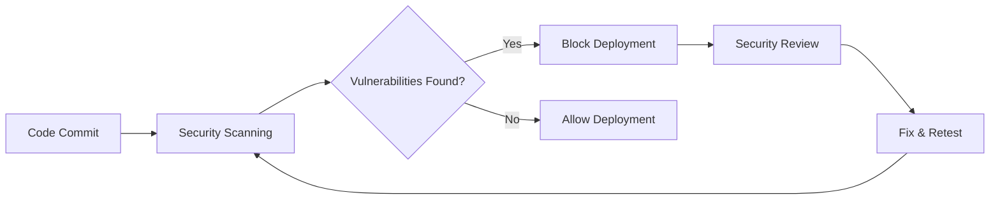

# Security Policy

## Overview

The Apollonia project takes security seriously. This document outlines our security practices, how
to report vulnerabilities, and our response process.

## Supported Versions

We provide security updates for the following versions:

| Version | Supported |
| ------- | --------- |
| main    | ✅ Yes    |
| 1.x.x   | ✅ Yes    |
| < 1.0   | ❌ No     |

## Security Features

### Built-in Security Measures

**Authentication & Authorization**:

- JWT-based authentication for API access
- Role-based access control (RBAC)
- API key authentication for service-to-service communication

**Data Protection**:

- Input validation and sanitization
- SQL injection prevention via parameterized queries
- XSS protection in frontend components
- CSRF protection for state-changing operations

**Infrastructure Security**:

- Container security with non-root user execution
- Network segmentation via Docker networks
- Environment variable protection for secrets
- Security scanning in CI/CD pipeline

**Monitoring & Logging**:

- Comprehensive audit logging
- Security event monitoring
- Failed authentication tracking
- Anomaly detection capabilities

## Security Scanning

### Automated Security Checks

Our CI/CD pipeline includes multiple security scanning tools:

**Static Analysis**:

- **CodeQL**: Advanced static analysis for Python and JavaScript
- **Bandit**: Python security vulnerability scanner
- **ESLint Security Plugin**: Frontend security linting

**Dependency Scanning**:

- **pip-audit**: Python package vulnerability scanning
- **npm audit**: Node.js package vulnerability scanning
- **Automated dependency updates** with security validation

**Container Security**:

- **Trivy**: Container image vulnerability scanning
- **Multi-stage builds** to minimize attack surface
- **Distroless base images** where possible

**SARIF Integration**: All security findings are uploaded to GitHub Security tab for centralized
tracking.

### Security Workflow



## Reporting Security Vulnerabilities

### Responsible Disclosure

If you discover a security vulnerability, please follow these steps:

1. **Do NOT** create a public GitHub issue
1. **Do NOT** discuss the vulnerability publicly
1. **Do** report it privately using one of the methods below

### Reporting Methods

**Email** (Preferred):

- Send details to: [robert@simplicityguy.com](mailto:robert@simplicityguy.com)
- Subject: `[SECURITY] Apollonia Vulnerability Report`
- Include "CONFIDENTIAL" in the subject line

**GitHub Security Advisory**:

- Go to the [Security tab](https://github.com/SimplicityGuy/apollonia/security)
- Click "Report a vulnerability"
- Fill out the private security advisory form

### What to Include

Please provide as much information as possible:

**Basic Information**:

- Vulnerability type (e.g., XSS, SQL injection, RCE)
- Affected component(s) and version(s)
- Severity assessment (Critical/High/Medium/Low)

**Technical Details**:

- Step-by-step reproduction instructions
- Proof-of-concept code or screenshots
- Potential impact and exploitation scenarios
- Suggested mitigation or fix approach

**Environment**:

- Operating system and version
- Browser and version (for web vulnerabilities)
- Deployment configuration details

### Example Report Template

```
Subject: [SECURITY] Apollonia Vulnerability Report - SQL Injection in API Endpoint

## Summary
Brief description of the vulnerability

## Vulnerability Details
- Type: SQL Injection
- Component: API Service
- Endpoint: /api/v1/search
- Severity: High

## Steps to Reproduce
1. Navigate to the search endpoint
2. Submit malicious payload: '1; DROP TABLE users; --
3. Observe SQL injection execution

## Impact
- Unauthorized data access
- Potential data modification/deletion
- Service disruption

## Suggested Fix
Use parameterized queries instead of string concatenation

## Additional Notes
Any other relevant information
```

## Response Process

### Timeline

We aim to respond to security reports within the following timeframes:

| Action                   | Timeline   |
| ------------------------ | ---------- |
| Initial Response         | 24 hours   |
| Vulnerability Assessment | 72 hours   |
| Fix Development          | 7-14 days  |
| Fix Deployment           | 1-3 days   |
| Public Disclosure        | 30-90 days |

### Response Steps

1. **Acknowledgment** (24 hours)

   - Confirm receipt of report
   - Assign tracking number
   - Provide initial assessment

1. **Investigation** (72 hours)

   - Reproduce the vulnerability
   - Assess impact and severity
   - Determine affected versions

1. **Fix Development** (7-14 days)

   - Develop and test fix
   - Create security patch
   - Prepare release notes

1. **Deployment** (1-3 days)

   - Deploy fix to production
   - Update supported versions
   - Monitor for issues

1. **Disclosure** (30-90 days)

   - Coordinate public disclosure
   - Publish security advisory
   - Credit reporter (if desired)

### Severity Classification

We use the following severity levels:

**Critical** (9.0-10.0 CVSS):

- Remote code execution
- Complete system compromise
- Mass data exposure

**High** (7.0-8.9 CVSS):

- Privilege escalation
- Significant data exposure
- Authentication bypass

**Medium** (4.0-6.9 CVSS):

- Limited data exposure
- Cross-site scripting (XSS)
- Information disclosure

**Low** (0.1-3.9 CVSS):

- Minor information leakage
- Non-exploitable vulnerabilities
- Configuration issues

## Security Best Practices

### For Users

**Deployment Security**:

- Use strong passwords and API keys
- Enable HTTPS/TLS in production
- Regularly update to latest versions
- Monitor security advisories

**Configuration Security**:

- Change default credentials
- Limit network exposure
- Enable audit logging
- Regular security assessments

**Environment Security**:

- Keep host systems updated
- Use firewall protection
- Monitor system logs
- Implement backup strategies

### For Developers

**Secure Coding**:

- Follow OWASP guidelines
- Validate all inputs
- Use parameterized queries
- Implement proper error handling

**Authentication & Authorization**:

- Use strong cryptographic standards
- Implement proper session management
- Follow principle of least privilege
- Regular security code reviews

**Data Protection**:

- Encrypt sensitive data at rest
- Use secure communication channels
- Implement proper access controls
- Regular data backup and recovery testing

## Security Resources

### External Security Tools

**Static Analysis**:

- [Bandit](https://bandit.readthedocs.io/) - Python security scanner
- [CodeQL](https://codeql.github.com/) - Advanced static analysis
- [ESLint Security](https://github.com/nodesecurity/eslint-plugin-security) - JavaScript security
  linting

**Dependency Scanning**:

- [pip-audit](https://pypi.org/project/pip-audit/) - Python dependency scanner
- [Safety](https://pypi.org/project/safety/) - Python security scanner
- [npm audit](https://docs.npmjs.com/cli/v8/commands/npm-audit) - Node.js dependency scanner

**Container Security**:

- [Trivy](https://trivy.dev/) - Container vulnerability scanner
- [Docker Scout](https://docs.docker.com/scout/) - Container security analysis
- [Snyk](https://snyk.io/) - Container and dependency scanning

### Security Standards

We follow industry-standard security frameworks:

- **OWASP Top 10**: Web application security risks
- **NIST Cybersecurity Framework**: Comprehensive security guidelines
- **ISO 27001**: Information security management
- **SANS Top 25**: Most dangerous software errors

### Security Training

Team members regularly participate in:

- Secure coding training
- Vulnerability assessment training
- Incident response exercises
- Security conference attendance

## Compliance and Auditing

### Regular Security Activities

**Code Reviews**:

- All code changes reviewed for security
- Security-focused code review checklist
- Automated security testing in CI/CD

**Vulnerability Management**:

- Weekly dependency vulnerability scans
- Monthly security assessment reviews
- Quarterly penetration testing (planned)

**Security Monitoring**:

- Real-time security event monitoring
- Regular log analysis and correlation
- Incident response plan testing

### Third-Party Security

**Dependencies**:

- Regular dependency updates
- Security-focused dependency selection
- Automated vulnerability monitoring

**Infrastructure**:

- Cloud security best practices
- Container security hardening
- Network security controls

## Contact Information

### Security Team

**Primary Contact**:

- Robert Wlodarczyk
- Email: [robert@simplicityguy.com](mailto:robert@simplicityguy.com)
- Role: Security Officer & Project Maintainer

**Response Team**:

- Security incidents: Immediate response
- Vulnerability reports: 24-hour acknowledgment
- General security questions: 48-hour response

### Public Security Information

- **GitHub Security**: [Security Tab](https://github.com/SimplicityGuy/apollonia/security)
- **Security Advisories**:
  [GitHub Advisories](https://github.com/SimplicityGuy/apollonia/security/advisories)
- **Vulnerability Database**: [CVE Database](https://cve.mitre.org/)

## Acknowledgments

We thank the security community for helping keep Apollonia secure:

- Security researchers who report vulnerabilities responsibly
- Open source security tools and their maintainers
- Security standards organizations and frameworks

______________________________________________________________________

**Last Updated**: December 2024

For questions about this security policy, please contact
[robert@simplicityguy.com](mailto:robert@simplicityguy.com).
