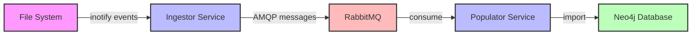

# Architecture Overview

Apollonia is a microservices-based file processing system that monitors directories for new files,
extracts metadata, and stores the information in a graph database.

## System Architecture



## Components

### 1. Ingestor Service

The Ingestor is responsible for:

- Monitoring a specified directory for file system events
- Computing file hashes (SHA256 and xxh128)
- Discovering related files (neighbors)
- Publishing file metadata to AMQP

**Key Features:**

- Asynchronous file monitoring using `asyncinotify`
- Efficient hashing with chunked reading
- Graceful shutdown on SIGINT/SIGTERM
- Automatic reconnection to AMQP

### 2. Message Queue (RabbitMQ)

RabbitMQ provides:

- Reliable message delivery between services
- Fan-out exchange pattern for scalability
- Message persistence for fault tolerance
- Dead letter queues for error handling

**Configuration:**

- Exchange: `apollonia` (fanout, durable)
- Queue: `apollonia-populator` (durable)
- Messages: JSON-encoded with persistent delivery

### 3. Populator Service

The Populator handles:

- Consuming messages from AMQP queue
- Parsing file metadata from messages
- Creating/updating nodes in Neo4j
- Establishing relationships between files

**Key Features:**

- Asynchronous message processing
- Automatic message acknowledgment
- Connection pooling for Neo4j
- Error handling with message requeuing

### 4. Graph Database (Neo4j)

Neo4j stores:

- File nodes with metadata properties
- Relationships between related files
- Query capabilities for file discovery

**Data Model:**

```cypher
// File Node
(:File {
    path: String,
    sha256: String,
    xxh128: String,
    size: Integer,
    modified: DateTime,
    accessed: DateTime,
    changed: DateTime,
    discovered: DateTime,
    event_type: String
})

// Neighbor Relationship
(:File)-[:NEIGHBOR]->(:File)
```

## Message Flow

### 1. File Detection

When a file is created or modified in the monitored directory:

```python
# Inotify events monitored
Mask.CREATE | Mask.MOVED_TO | Mask.CLOSE_WRITE
```

### 2. Metadata Extraction

The Prospector class extracts:

- File path (absolute)
- SHA256 and xxh128 hashes
- File size and timestamps
- Related files (neighbors)

### 3. Message Format

```json
{
    "file_path": "/data/example.txt",
    "event_type": "IN_CREATE",
    "sha256_hash": "abc123...",
    "xxh128_hash": "def456...",
    "size": 1024,
    "modified_time": "2024-01-01T12:00:00+00:00",
    "accessed_time": "2024-01-01T12:00:00+00:00",
    "changed_time": "2024-01-01T12:00:00+00:00",
    "timestamp": "2024-01-01T12:00:00+00:00",
    "neighbors": [
        "/data/example.txt.meta",
        "/data/example.log"
    ]
}
```

### 4. Graph Storage

The Populator creates nodes and relationships:

```cypher
// Create or update file node
MERGE (f:File {path: $file_path})
SET f.sha256 = $sha256_hash,
    f.xxh128 = $xxh128_hash,
    f.size = $size,
    ...

// Create neighbor relationships
MERGE (f1:File {path: $file_path})
MERGE (f2:File {path: $neighbor_path})
MERGE (f1)-[:NEIGHBOR]->(f2)
```

## Design Patterns

### 1. Microservices Architecture

- **Loose Coupling**: Services communicate only through message queue
- **Independent Deployment**: Each service has its own Docker image
- **Technology Agnostic**: Services can be implemented in different languages
- **Horizontal Scaling**: Multiple instances can process messages concurrently

### 2. Event-Driven Architecture

- **Asynchronous Processing**: File events trigger message flow
- **Event Sourcing**: All file events are captured and stored
- **Eventual Consistency**: Graph database updates happen asynchronously

### 3. Resilience Patterns

- **Circuit Breaker**: Services handle connection failures gracefully
- **Retry Logic**: Failed operations are retried with backoff
- **Health Checks**: Docker health checks ensure service availability
- **Graceful Shutdown**: Services clean up resources on termination

## Deployment Architecture

### Docker Composition

```yaml
services:
  rabbitmq:    # Message broker
  neo4j:       # Graph database
  ingestor:    # File monitor
  populator:   # Data importer
```

### Container Features

- **Multi-stage Builds**: Optimized image sizes
- **Non-root Users**: Security best practice
- **Health Checks**: Container orchestration support
- **Volume Mounts**: Persistent data storage

## Scalability Considerations

### Horizontal Scaling

- **Ingestor**: Can monitor different directories
- **Populator**: Multiple instances process messages concurrently
- **RabbitMQ**: Clustered deployment for HA
- **Neo4j**: Read replicas for query scaling

### Performance Optimization

- **Batch Processing**: Group multiple file events
- **Connection Pooling**: Reuse database connections
- **Caching**: Hash computation results
- **Async I/O**: Non-blocking file operations

## Security Architecture

### Authentication & Authorization

- **AMQP**: Username/password authentication
- **Neo4j**: User-based access control
- **Docker**: Non-root container execution

### Data Protection

- **Message Encryption**: TLS for AMQP connections
- **Database Encryption**: Neo4j encryption at rest
- **Network Isolation**: Docker network segmentation

## Monitoring & Observability

### Logging

- **Structured Logging**: JSON-formatted logs
- **Log Aggregation**: Centralized log collection
- **Log Levels**: Configurable verbosity

### Metrics

- **Service Health**: Uptime and availability
- **Performance**: Message processing rates
- **Resource Usage**: CPU, memory, disk I/O

### Tracing

- **Message Flow**: Track messages through system
- **Error Tracking**: Failed message processing
- **Latency Analysis**: End-to-end processing time
