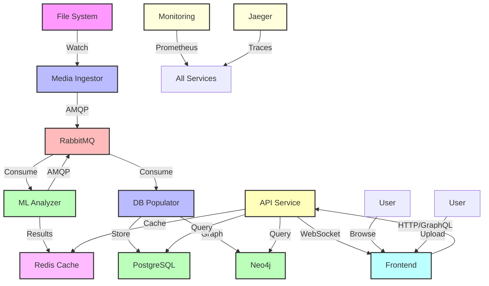

# Apollonia Architecture Overview

## System Design

Apollonia is a comprehensive media catalog system built as a distributed microservices architecture,
designed for scalability, resilience, and real-time media processing. The system follows
event-driven patterns with asynchronous message passing between services.

## System Architecture



## Core Components

### 1. Media Ingestor Service

The Media Ingestor monitors file systems for media files and initiates processing:

- **Purpose**: Real-time media file detection and cataloging
- **Technology**: Python 3.12, asyncinotify
- **Key Features**:
  - Monitors multiple directories simultaneously
  - Detects media formats (audio: MP3, WAV, FLAC; video: MP4, AVI, MOV)
  - Computes file hashes (SHA256, xxh128) for deduplication
  - Discovers related files (subtitles, metadata, artwork)
  - Publishes events to AMQP for downstream processing

### 2. ML Analyzer Service

Extracts features from media files using machine learning:

- **Purpose**: Audio/video analysis and feature extraction
- **Technology**: Python 3.12, TensorFlow, Essentia
- **Key Features**:
  - Audio analysis: tempo, key, mood, genre classification
  - Video analysis: scene detection, object recognition, quality assessment
  - Model management with caching and lazy loading
  - Async processing with result caching in Redis
  - Configurable for GPU acceleration

### 3. Database Populator Service

Persists all metadata and ML results:

- **Purpose**: Data persistence and relationship management
- **Technology**: Python 3.12, SQLAlchemy, py2neo
- **Databases**:
  - PostgreSQL: Primary store for structured metadata
  - Neo4j: Graph relationships between media files
- **Key Features**:
  - Batch processing for efficiency
  - Transaction management with rollback
  - Data validation and error handling
  - Relationship mapping between related files

### 4. API Service

Provides REST and GraphQL APIs:

- **Purpose**: Client access to media catalog
- **Technology**: Python 3.12, FastAPI, Strawberry GraphQL
- **Key Features**:
  - JWT authentication with OAuth2 flow
  - RESTful endpoints for CRUD operations
  - GraphQL for flexible queries
  - Redis caching for performance
  - WebSocket support for real-time updates
  - Comprehensive API documentation

### 5. Frontend Application

Modern web interface for users:

- **Purpose**: User interaction and visualization
- **Technology**: React 18, TypeScript, Vite
- **Key Features**:
  - Responsive design with dark mode
  - Real-time processing status
  - Drag-and-drop file upload
  - Interactive analytics dashboards
  - Advanced search and filtering
  - Batch operations support

### 6. Supporting Infrastructure

#### Message Queue (RabbitMQ)

- Fan-out exchanges for scalability
- Persistent messages for reliability
- Dead letter queues for error handling

#### Cache Layer (Redis)

- ML model results caching
- API response caching
- Session management
- Real-time metrics

#### Databases

- **PostgreSQL**: ACID-compliant primary datastore
- **Neo4j**: Graph relationships and recommendations

## Message Flow

### 1. File Detection

When a file is created or modified in the monitored directory:

```python
# Inotify events monitored
Mask.CREATE | Mask.MOVED_TO | Mask.CLOSE_WRITE
```

### 2. Metadata Extraction

The Prospector class extracts:

- File path (absolute)
- SHA256 and xxh128 hashes
- File size and timestamps
- Related files (neighbors)

### 3. Message Format

```json
{
    "file_path": "/data/example.txt",
    "event_type": "IN_CREATE",
    "sha256_hash": "abc123...",
    "xxh128_hash": "def456...",
    "size": 1024,
    "modified_time": "2024-01-01T12:00:00+00:00",
    "accessed_time": "2024-01-01T12:00:00+00:00",
    "changed_time": "2024-01-01T12:00:00+00:00",
    "timestamp": "2024-01-01T12:00:00+00:00",
    "neighbors": [
        "/data/example.txt.meta",
        "/data/example.log"
    ]
}
```

### 4. Graph Storage

The Populator creates nodes and relationships:

```cypher
// Create or update file node
MERGE (f:File {path: $file_path})
SET f.sha256 = $sha256_hash,
    f.xxh128 = $xxh128_hash,
    f.size = $size,
    ...

// Create neighbor relationships
MERGE (f1:File {path: $file_path})
MERGE (f2:File {path: $neighbor_path})
MERGE (f1)-[:NEIGHBOR]->(f2)
```

## Design Patterns

### 1. Microservices Architecture

- **Loose Coupling**: Services communicate only through message queue
- **Independent Deployment**: Each service has its own Docker image
- **Technology Agnostic**: Services can be implemented in different languages
- **Horizontal Scaling**: Multiple instances can process messages concurrently

### 2. Event-Driven Architecture

- **Asynchronous Processing**: File events trigger message flow
- **Event Sourcing**: All file events are captured and stored
- **Eventual Consistency**: Graph database updates happen asynchronously

### 3. Resilience Patterns

- **Circuit Breaker**: Services handle connection failures gracefully
- **Retry Logic**: Failed operations are retried with backoff
- **Health Checks**: Docker health checks ensure service availability
- **Graceful Shutdown**: Services clean up resources on termination

## Deployment Architecture

### Docker Composition

```yaml
services:
  # Infrastructure
  postgres:    # Primary datastore
  rabbitmq:    # Message broker
  redis:       # Cache layer
  neo4j:       # Graph database

  # Core Services
  ingestor:    # File monitor
  analyzer:    # ML processor
  populator:   # Data importer
  api:         # REST/GraphQL API
  frontend:    # React web app

  # Monitoring
  prometheus:  # Metrics collection
  grafana:     # Metrics visualization
  jaeger:      # Distributed tracing
```

### Container Features

- **Multi-stage Builds**: Optimized image sizes (~100MB per service)
- **Non-root Users**: Security best practice (UID 1001)
- **Health Checks**: Container orchestration support
- **Volume Mounts**: Persistent data storage
- **Network Isolation**: Service-specific networks
- **Resource Limits**: CPU and memory constraints

## Scalability Considerations

### Horizontal Scaling

- **Ingestor**: Can monitor different directories
- **Analyzer**: Multiple instances for parallel ML processing
- **Populator**: Multiple instances process messages concurrently
- **API**: Load balanced instances with shared cache
- **RabbitMQ**: Clustered deployment for HA
- **PostgreSQL**: Read replicas with connection pooling
- **Neo4j**: Read replicas for query scaling

### Performance Optimization

- **Batch Processing**: Group multiple file events
- **Connection Pooling**: Reuse database connections
- **Caching**: Hash computation results
- **Async I/O**: Non-blocking file operations

## Security Architecture

### Authentication & Authorization

- **API**: JWT tokens with OAuth2 flow
- **AMQP**: Username/password authentication
- **PostgreSQL**: Role-based access control
- **Neo4j**: User-based access control
- **Docker**: Non-root container execution

### Data Protection

- **Message Encryption**: TLS for AMQP connections
- **API Encryption**: HTTPS with TLS 1.3
- **Database Encryption**: PostgreSQL and Neo4j encryption at rest
- **Network Isolation**: Docker network segmentation
- **Secret Management**: Environment variables for sensitive data

## Monitoring & Observability

### Logging

- **Structured Logging**: JSON-formatted logs
- **Log Aggregation**: Centralized log collection
- **Log Levels**: Configurable verbosity

### Metrics

- **Service Health**: Uptime and availability
- **Performance**: Message processing rates
- **Resource Usage**: CPU, memory, disk I/O
- **Application Metrics**: Request rates, response times
- **Business Metrics**: Files processed, ML analysis completion

### Tracing

- **Message Flow**: Track messages through system
- **Error Tracking**: Failed message processing
- **Latency Analysis**: End-to-end processing time
- **Distributed Tracing**: Jaeger integration
- **Request Correlation**: Trace IDs across services

## Technology Stack Summary

### Languages & Frameworks

- **Backend**: Python 3.12 (FastAPI, SQLAlchemy, aio-pika)
- **Frontend**: TypeScript, React 18, Vite
- **ML/AI**: TensorFlow, Essentia, Librosa

### Data Storage

- **PostgreSQL**: Structured metadata
- **Neo4j**: Graph relationships
- **Redis**: Caching and sessions

### Infrastructure

- **Docker**: Containerization
- **RabbitMQ**: Message broker
- **GitHub Actions**: CI/CD
- **Prometheus/Grafana**: Monitoring
